# EMH
<h3>Abstract:</h3> 
Smart Mental Health Helpline is an online mental health helpline designed to provide counseling services through video conferencing. The system consists of three modules: admin, doctor, and users. 
<h1>Modules Explanation</h1>
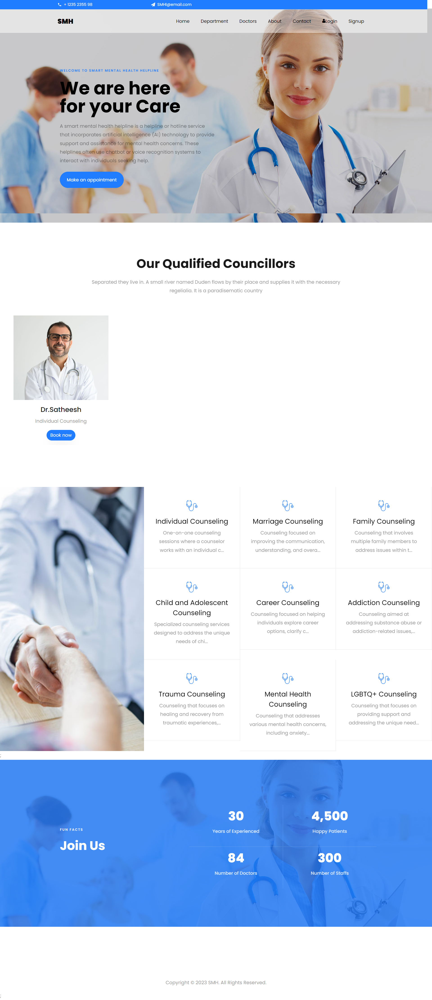 
<b>Admin Module</b>
In the admin module, the administrator has the ability to add doctors to the platform. Once a doctor is added, they receive a mail notification informing them of their addition. The admin is also responsible for managing and adding various departments for service categorization. Additionally, the admin handles inquiries and messages from users. 
<b>Doctor/Councillor Module</b>
The doctor/counselor module allows doctors to manage their counseling schedule by adding counseling dates and providing video joining links for users who have booked slots. Doctors can also publish blogs and engage in interactions with patients, fostering a supportive environment. 
<b>User Module</b>
In the user module, users can view the profiles of different doctors and book appointments with their preferred professionals. The booking process is facilitated through Stripe payment gateways, ensuring secure transactions. Furthermore, users have the ability to provide reviews and feedback on their counseling experiences, promoting transparency and quality improvement. 

Overall, the Smart Mental Health Helpline offers a comprehensive platform for individuals seeking mental health support. Through its user-friendly interface and efficient features, it aims to bridge the gap between mental health professionals and those in need, fostering a healthier society. 
<h3>About Us</h3> 
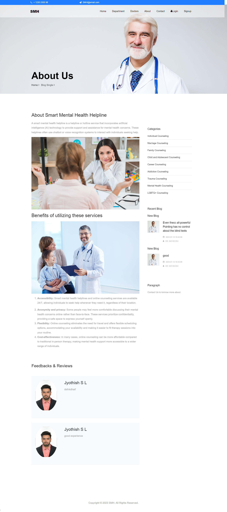 
 <h3>Contact</h3> 
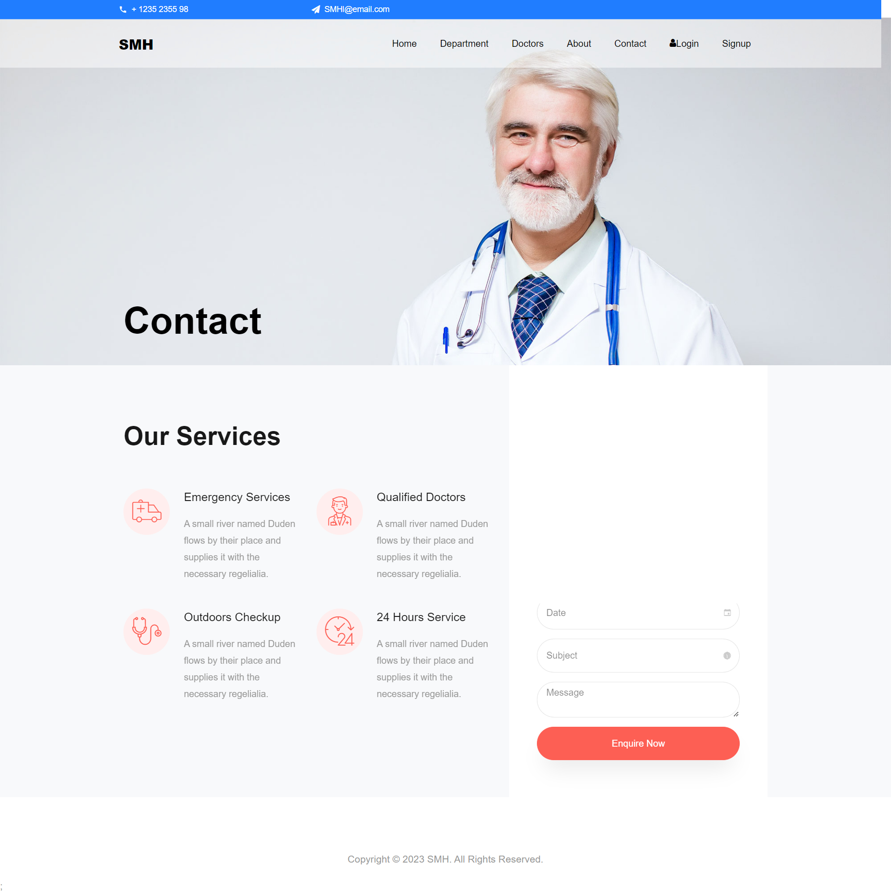 
 <h3>Blogs</h3> 
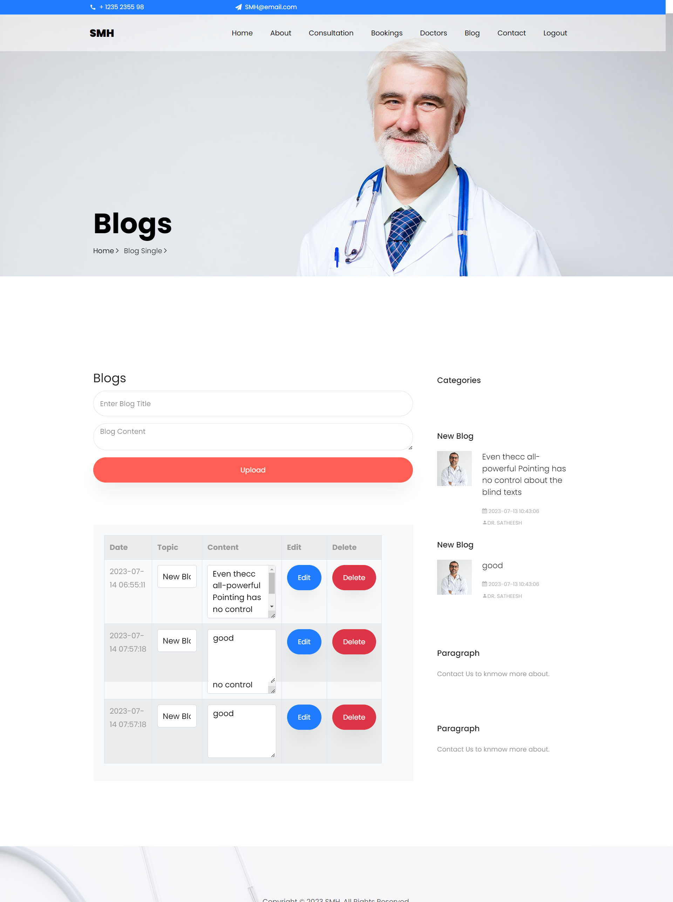 
 <h3>Admin</h3> 
 
 <h3>Specilization</h3> 
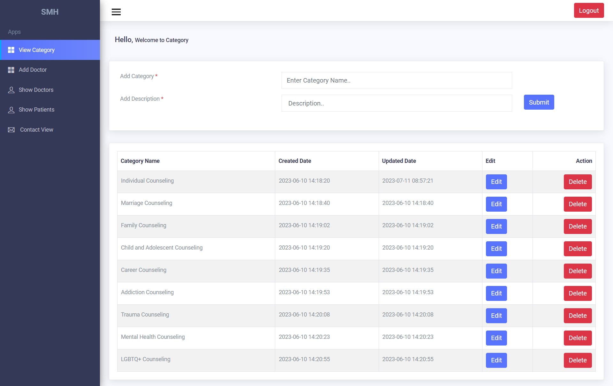 
 <h3>Video Meeting</h3> 
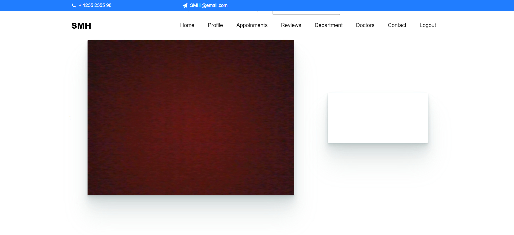 
 <h3>Payment</h3> 
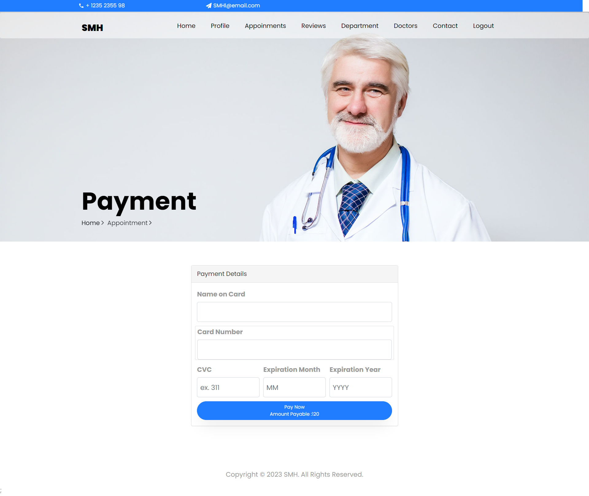 
 <h3>Patients</h3> 
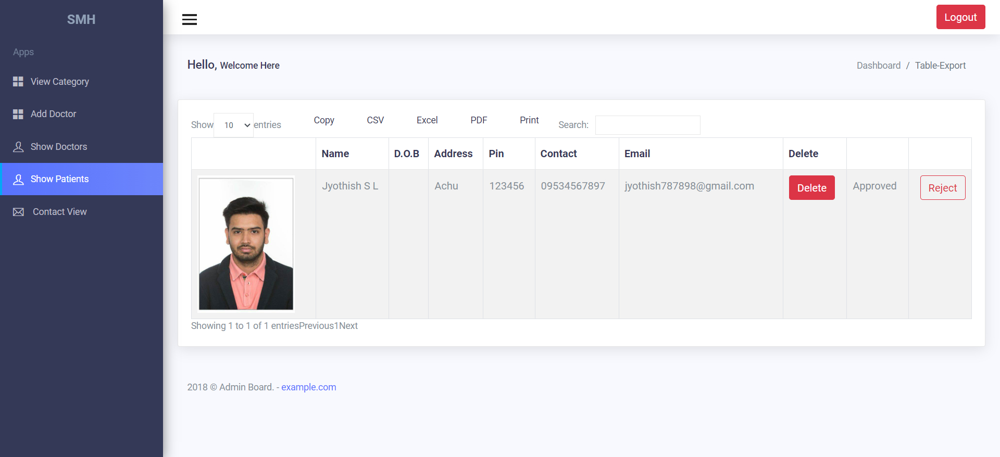 
 <h3>Enquiry</h3> 
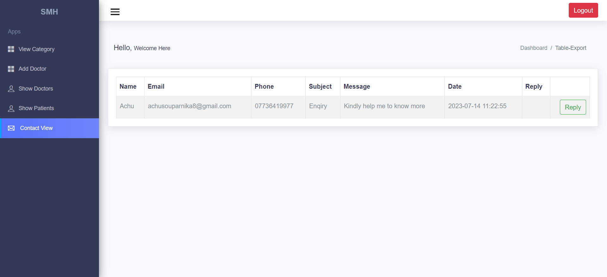 
 <h3>Bookings</h3> 
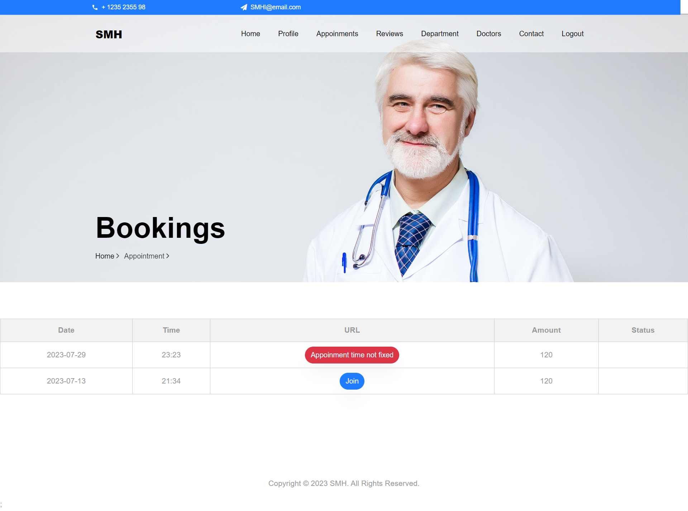 
 <h3>Appoinments</h3> 
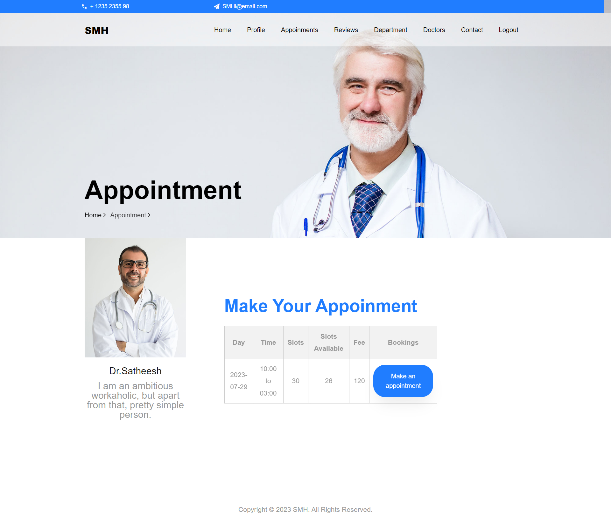 
 <h3>Login</h3> 
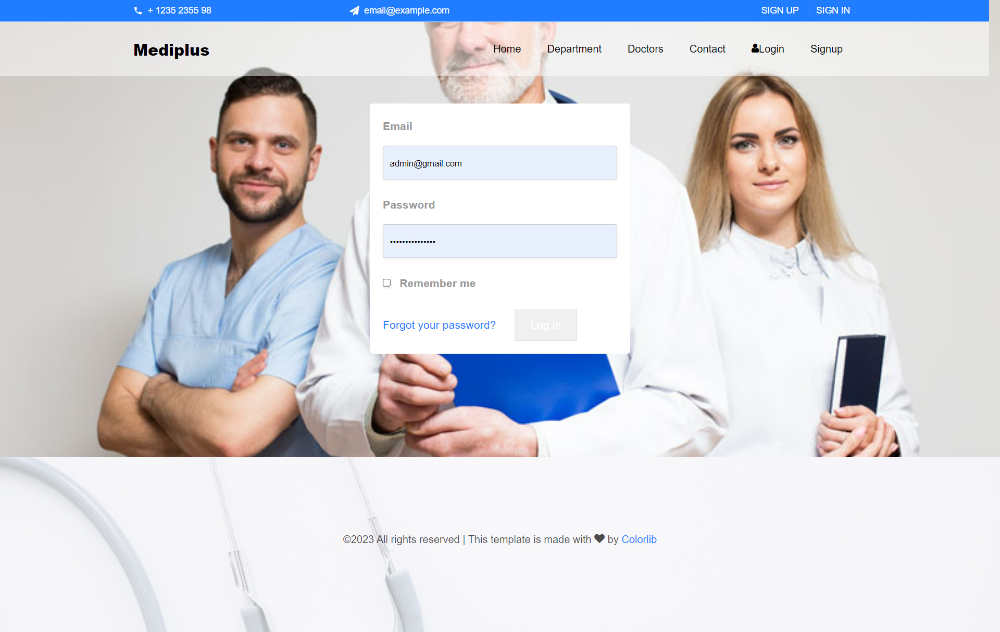 

